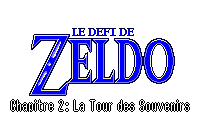

# Le Défi de Zeldo - Ch. 2 : La Tour des Souvenirs

**Le Défi de Zeldo - Ch. 2** is, obviously, the sequel of the first chapter. The game is in the same vein than *A Link to the Past* but with in a whackier universe than the typical Legend of Zelda games, to which multiple video games characters join, and lots of references.

- **Release Date:** May 10th, 2019
- **Players:** 1
- **Length:** 3-6 hours
- **License:** Copyrighted assets + CC BY-SA 4.0 assets.
- **Languages:** English, French

## Synopsis

The game takes place just after the events of the first chapter, which was a little game with just one short dungeon beatable in 40 min, from 2017.

After having touched the Trophy of Victory won at the end of the first chapter's dungeon, Link is teleported in High-rule, a parallel world where multiple video games universes are mixed up. Link must go to the Tower of Memories where Zeldo is waiting for him to get his revenge!

